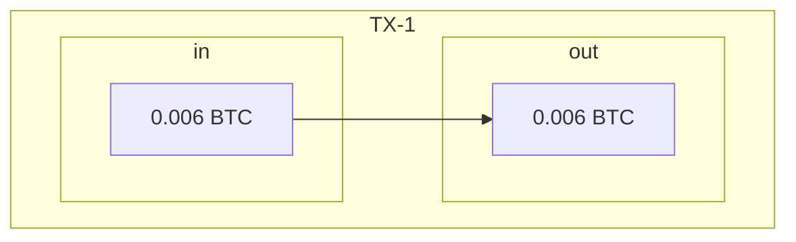
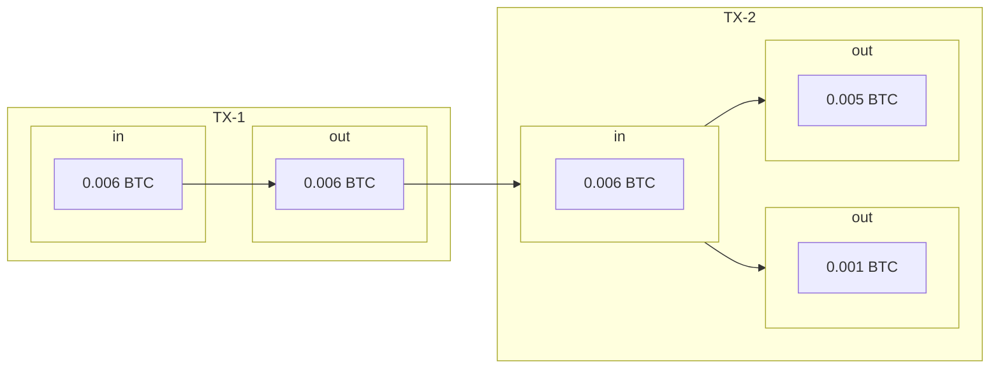
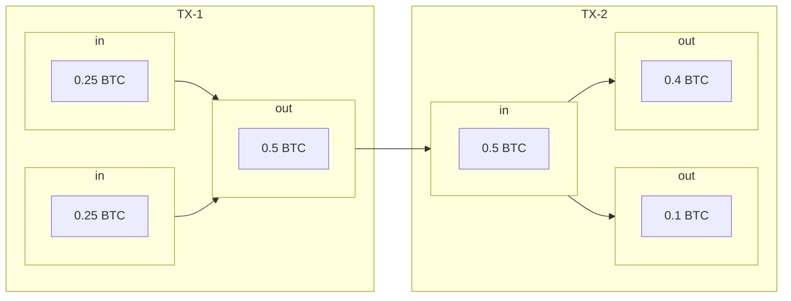

<!--
Lord Jesus Christ
Son of God
Have mercy on me, a sinner
-->

# Imperfect Metaphors

> Bitcoin is unlike *anything* that has *ever* existed.

Bitcoin is unlike any money or monetary system.
 It is unlike any technology or network --
 there's really nothing like it in history.
As a result, any attempt at explaining Bitcoin
 will rely either on imperfect metaphors, or novel technical terms.
For example, the word *custody* is a misnomer,
 an anachronism from a simpler time when banks would *custody* your money.

In reality, there are no actual coins to custody.
Bitcoin is pure information; 
 information copied publicly in a cryptographic ledger.
Everyone can have a copy of the ledger,
 and everyone can validate that the ledger is correct.
And similar to how the Internet empowered individuals to share ideas with the world,
 Bitcoin empowers individuals to custody their wealth,
 and to do so in ways far more secure than any bank ever could.

And because Bitcoin is money, 
 there are many traditional metaphors
 (such as *wallets*, *coins*, and *addresses*)
 that can be useful, 
 but at the same time may lead to a great deal of confusion.
Bitcoin is in a category all to itself
 -- the physical limitations of *custody*, *wallets*, *coins*, and *addresses* simply don't apply to Bitcoin.
And thus to *custody* your Bitcoin, means something very different than anything you've thought about before Bitcoin.

We will describe these imperfect metaphors
 and attempt to demystify them, and then
 discuss the more accurate technical concepts
 necessary for understanding the truth of Bitcoin
 and what it really means to *custody your Bitcoin*.

## Wallets

In Bitcoin, the word *wallet* is a misnomer,
 possibly the most confusing metaphor in Bitcoin.
The term *wallet* in Bitcoin can mean different things.
It can refer to a collection of private keys, 
 or invoice addresses,
 or UTXO sets,
 or as the hardware or software to manage any of the above.
But a Bitcoin wallet is most certainly NOT 
 a collection of your Bitcoin.

!!! warning "There is no Bitcoin stored in a Bitcoin wallet."

The traditional meaning of the word *wallet* simply doesn't apply to Bitcoin.
 The word *wallet* was used in Bitcoin because the original Bitcoin core client app would store private keys in a file named `wallet.dat`.
 
### Hot Wallet

A *hot wallet* refers to any software or hardware that stores your private keys in a device connected to the Internet, 
 allowing you to send and receive Bitcoin.
If a private key is directly accessible to an online device, this makes it *hot*.

E.g., if you have a Bitcoin wallet app on your phone that can send and receive Bitcoin, 
 this is referred to as a *hot wallet*.

### Cold Storage Wallet

If you store private keys offline, 
 in a device never connected to the Internet, 
 this is referred to as *cold storage*.
There are obvious security benefits,
 and *cold storage* is the recommended approach 
 for safe custody of your Bitcoin.

There are many cold storage practices, 
 and they follow a standard pattern,

1. private keys are stored offline (e.g., in an air-gapped device).
1. public keys can be stored in an Internet-connected device.
1. for receiving Bitcoin,
    1. the public key can generate receive addresses, and 
    1. verify transactions.
1. for sending Bitcoin,
    1. the public key can generate an *unsigned transaction*, then
    1. the *unsigned transaction* is transfered to the air-gapped device, then
    1. the transaction is **signed** on the air-gapped device, then
    1. the *signed transaction* is transfered to an Internet-connected device, and then broadcast to the network.

There are many variations of cold storage but they all adhere to the above pattern;
 sometimes with additional steps meant to increase security.  
> E.g., using a seed signer, a private key is never stored in any electronic device, air-gapped or otherwise.
> Instead the key is generated from the seed phrase and used on a signing device only when needed (and discarded immediately afterwards). 

### Wallets Demystified

A Bitcion wallet is not a collection of your Bitcoin.
Rather, a Bitcoin wallet is any device or procedure used 
 to manage your private keys (necessary to send
 and receive Bitcoin).
This includes
 [hardware wallets](securing-keys/hardware-wallets.md),
 as well as 
 [protocols](protocols/index.md)
 to manage private keys.

## Keys

!!! danger "Not your keys, not your Bitcoin."

It is your Bitcoin keys that you custody.
Specifically, you custody your private keys,
 usually by storing the seed phrase 
 that can generate your private keys and
 their corresponding public keys.
This is afterall based on
 [public key cryptography](https://en.wikipedia.org/wiki/Public-key_cryptography),
 specifically
 [elliptic-curve cryptography](https://en.m.wikipedia.org/wiki/Elliptic-curve_cryptography).

If you're unfamiliar with these concepts,
 the purpose is that *public keys*
 can create encrypted information that can
 only be decrypted by the corresponding
 *private keys*.
Or in the case of Bitcoin, *public keys*
 can create transaction outputs that 
 can only be spent by the corresponding
 *private keys*.
In other words, you can receive Bitcoin
 through your *public keys*
 (or rather, addresses generated by your public keys),
 and you can spend Bitcoin by using
 your *private keys*.

A *seed phrase* is a list of words
 that encode a 256-bit number
 that can derive
 private keys and their corresponding public keys,
 as well as the addresses that can
 be used in transactions.
In other words, it is a phrase (typically 24 words)
 that can be used to recover your Bitcoin.
This process of deriving keys and addresses from a seed phrase
 is knows as 
 *Hierarchical Deterministic (HD) Wallets*.

### Hierarchical Determinism

In practice,
 *Hierarchical Deterministic (HD) Wallets*
 allow you to save a single seed phrase
 and use that seed to derive as many keys and addresses as you need.
This could be as simple as a single account with a single key
 that you use only once, or this could be millions of
 accounts used by an instition, such that each account
 can generate its own keys and addresses.

???+ info "Brief History"
    Early version of Bitcoin generated private keys and addresses
    randomly, requiring users to backup all of the private keys
    associated with any of the addresses they had used.

    *HD wallets* on the other hand can generate an unlimited number of private keys
    and addresses, or rather, an unlimited number of accounts,
    each with their own keys and address space. And all of those
    accounts, keys, and addresses can be derived from a single seed phrase.

### Keys Demystified

Public keys are used to receive Bitcoin, and private keys
 are used to spend Bitcoin (by signing a transaction).
A seed phrase can be backed up and is used to generate
 public and private keys in a predictable (deterministic) way,
 such that your seed phrase is the most critical piece
 of information to secure.

## Addresses

A Bitcoin *address* is a misnomer,
 and when not understood properly can lead to a great deal of confusion.
The word *address* implies your Bitcoin is located at this address.
In reality, there is no *address* where your Bitcoin is located.
There are only transactions, which have inputs and outputs, and the outputs are either spent or unspent.

Transaction inputs are created from the unspent outputs of a previous transaction.
And these ouputs are created using an address.
This makes the unspent transaction outputs spendable only by 
 the corresponding private key associated with the address.

There are two types of addresses, receive addresses
 (also known as invoice addresses) and change addresses.

### Invoice Addresses

Imagine you receive `0.006 Bitcoin` to an address in your wallet.
 This will create a transaction with an output using your address.

Then you send `0.001 Bitcoin` to someone else (to an invoice address they sent you).

It is tempting to think your original address now has 0.005 Bitcoin, 
 but in reality your original address has nothing. 
 The original transaction output is *spent*.

When you send the 0.001 Bitcoin,
 this will create a *new* transaction with **two** outputs:

One output has `0.001 Bitcoin`, and another with `0.005 Bitcoin` 
 (for simplicity, this is ignoring transaction fees).

Your private key can access the output with `0.005 Bitcoin`,
 and someone else has the private key to access the output with `0.001 Bitcoin`.
The output at `0.005 Bitcoin` uses a *change address*.
The original transaction output of 0.006 Bitcoin is already spent,
 and your Bitcoin is only available in the new *unspent transaction outputs*.

!!! warning "These *unspent transaction ouputs* are known as UTXOs (see below)."

### Change Addresses

Here is a
 [real transaction](https://blockstream.info/tx/7778ab22eab23c9c9770bdfeec4988dc52034c01e68053cecc3e54af6b9d9186)
 where someone spent `0.001 Bitcoin` from a previous
 UTXO address that contained `0.006 Bitcoin`.
In addition to a transaction fee of `0.00007718 Bitcoin`,
 there was `0.00492282 Bitcoin` sent to a *change address*.

Every invoice address has a corresponding *change address*,
 which as the name implies, is the *change* of the spent
 transaction output.

### Addresses Demystified

An address is not a location where Bitcoin is stored, 
 but is a number used to generate a transaction output (see UTXOs below).
An *invoice address* (aka *receive address*), 
 is what you would use to receive Bitcoin.
And when you spend Bitcoin (from an unspent transaction), any remainder
 will be sent to a *change address*.

## Transactions

Bitcoin is a protocol managing a cryptographic ledger,
 and this ledger is made up of ordered *transactions*.
Transactions are ordered through *blocks*,
 such that a block is merely a collection of transactions.

A *transaction* has inputs and an outputs.
The inputs must come from one or more unspent outputs
 of prior transactions.
The only exception is the special
 [coinbase](https://river.com/learn/terms/c/coinbase/)
 transaction, which is the reward given to
 whoever successfully mined a new block
 (thus it has no input from a prior transaction).
Otherwise, all transactions are composed of
 inputs from previously unspent transaction outputs (UTXOs).

<!--
https://developer.bitcoin.org/reference/transactions.html

https://en.bitcoin.it/wiki/Transaction

https://developer.bitcoin.org/devguide/block_chain.html

-->

### UTXOs

As the name implies,
 an *Unspent Transaction Output* (UTXO)
 is the total amount of addressable Bitcoin at
 any given time.
Every UTXO contains an address such that the UTXO can only be spent
 by the *private key (or keys)* associated with that address.

### Transactions Demystified

Transactions are simply the movement of Bitcoin
 on the ledger, such that the entire supply of all
 Bitcoin can be accounted for.
A transaction is simply inputs and outputs which
 move the balance of Bitcoin to different
 cryptographic addresses (accessible only
 by private keys).

## Blockchain

The word *"blockchain"* is perhaps the most misunderstood and overhyped word related to Bitcoin.
Next time you read an article on *"blockchain technology"* replace the word
 *"blockchain"* with *"magic"* and you won't have changed the article's meaning.

???+ example "blockchain or magic?"
    All the data in {--blockchain--}{++magic++} technology is immutable
    and can be adapted for use in a variety of industries,
    including healthcare, supply chain management, and voting.

A *blockchain*, like the name implies,
 is simply a chain of blocks.
And a block is a collection of transactions.
*That's it.*
It's an implementation detail as interesting as a
 [linked list](https://en.wikipedia.org/wiki/Linked_list).
And if you consider it a distributed database,
 it is a slow and inefficient database.

By itself a blockchain is not secure;
 it is as mutable as any other data;
 and it has
 none of the magic often associated
 with it (by those easily confused by technology
 and the subtle differences between technology and magic).
A blockchain offers absolutely no value to
 healthcare, supply chain management, or voting.

Ultimately, a blockchain only makes sense in the context of
 a *proof of work (PoW)* consenus mechanism whose security
 comes from the considerable cost of *work* in the PoW.

### Proof of Work

A typical blockchain diagram will look something like this,

Each block has a hash.
A block hash is a 
 [sha256](https://en.wikipedia.org/wiki/SHA-2)
 of the entire block itself
 (which includes the previous block hash).
This is a cryptographic function that
 takes any input (in this case a block) and 
 generates a 256-bit number as output.
A block can be referenced by its hash
 as well as by block height (starting at 1).
Here are some examples of actual block hashes:

 * Genesis -> [`00000000839a8e6886ab5951d76f411475428afc90947ee320161bbf18eb6048`](https://blockstream.info/block/00000000839a8e6886ab5951d76f411475428afc90947ee320161bbf18eb6048)
 * 100100 -> [`0000000000020ee4806021c0b6e7b97d31df0c2fdbd0f6c3a7cb5883c7bc151f`](https://blockstream.info/block/0000000000020ee4806021c0b6e7b97d31df0c2fdbd0f6c3a7cb5883c7bc151f)
 * 200201 -> [`00000000000000e510b96fcf03e27ad30f8d50e4cd4cb7cf4c06cf7ffb9add3e`](https://blockstream.info/block/00000000000000e510b96fcf03e27ad30f8d50e4cd4cb7cf4c06cf7ffb9add3e)
 * 300301 -> [`00000000000000002887537d323675f79cc5eddce91b3c0dd433739cbfe9c823`](https://blockstream.info/block/00000000000000002887537d323675f79cc5eddce91b3c0dd433739cbfe9c823)
 * 700700 -> [`00000000000000000000e55da58b378880e797f9f3e96811d3e64a2f801eed9a`](https://blockstream.info/block/00000000000000000000e55da58b378880e797f9f3e96811d3e64a2f801eed9a)

These hashes have a lot of leading zeroes,
 and as time goes on, the number of leading zeroes seems to increase.
This is due to *proof of work* (and network difficulty
 increasing over time).

There is a common misnomer that PoW involves
 solving a difficult
 mathematical problem.
In fact, all PoW does is provide a verifiable
 block hash that is smaller than the current
 network difficulty.
In other words, the hash is simply a number
 (a 256-bit number) that is smaller than
 the network difficulty number.
This is why you see leading zeroes.

The reason this is a *proof* of work
 is because generating a valid block
 requires massive amounts of work.
A Bitcoin miner constantly
 adjusts a proposed block 
 (see the `nonce` in the header)
 and generates a sha256 hash,
 essentially a guess.
Every miner repeats this, over and over,
 until finally *-- and by dumb luck --*
 the hash is smaller than the network difficulty.
If the hash is valid (adhering to consensus rules)
 then the rest of the network will accept the
 proposed block.

There is also a `timestamp` field in each block,
 meaning the Bitcoin network is also a distributed
 timestamp server.
This allows the PoW blockchain to keep track of time.
And due to what is known as the
 [difficulty adjustment](https://river.com/learn/terms/d/difficulty/),
 the network will adjust the 
 difficulty number in order to maintain a 10-minute average block time.
The difficulty will adjust
 every 2016 blocks (roughly every 2-weeks; and 2016 reversed is 6102,
 a subtle reference to 
 [executive order 6102](https://en.wikipedia.org/wiki/Executive_Order_6102)).
This is why the PoW blockchain
 is more aptly known as the
 Bitcoin *timechain*.

### Timechain

The PoW blockchain is better known as a *timechain* because it provides
 a chronological order to all transactions, creating its own *time* in the process.
From the [whitepaper](/images/bitcoin.pdf), Bitcoin provides
*"a solution to the double-spending problem using a peer-to-peer
 distributed timestamp server to generate computational proof
 of the chronological order of transactions"*.

In other words, Bitcoin provides *order* that lays itself out over time;
  that is, we know the precise order of transactions,
  as well as the future supply of Bitcoin.
We can predict with high accuracy what the Bitcoin supply will be at any point in the future
 (something you cannot do with gold or fiat).

The timechain does not repeat.
There are no circular paths in Bitcoin time.
It is linear, keeping a pulse, a new block, every 10-minutes on average.

Symbolically, Bitcoin is bringing order out of monetary chaos.
What was once chaotic and unknowable (how much money is there and how is it distributed), 
 is now knowable with Bitcoin in a true sense of the word  *order* (order out of chaos).

### Blockchain Demystified

A blockchain is a chain of blocks, nothing fancy nor magic.
What changed the world was not the invention of a blockchain
 (something that already existed as far back as 
 [1995](https://www.vice.com/en/article/j5nzx4/what-was-the-first-blockchain)).
What changed the world was the invention of Bitcoin,
 a distributed timestamp server
 with a PoW consensus mechanism and difficult adjustment,
 giving us the most sound money to ever exist.

Focusing on a blockchain as innovation is like focusing on how the 
 *Wright brothers* invented a wing rather than manned flight,
 all while claiming wings would revolutionize trains.
 

